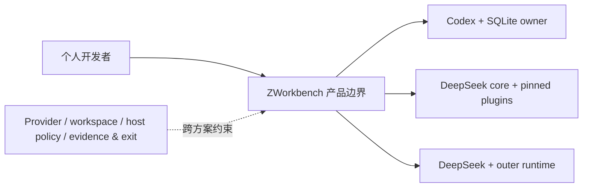
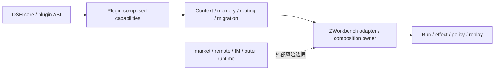

# 调研主题
DeepSeek Harness 插件生态是否足以挑战 Codex 主线

前一轮结论把 core-only 的未证明能力过度外推为生态缺口。本轮固定 19 个 DeepSeek 生态相关仓库，证实插件 ABI、市场/雷达、观测、记忆、路由、迁移和跨 Harness bridge 已形成可研究的能力供给；但它们尚未通过 ZWorkbench 的统一安全、状态 owner、回放、版本和小团队运维门槛。因此 DeepSeek plugin-composed bundle 应升级为一等挑战架构，Codex + 单一 composition owner 暂保持生产主线。

## 输入材料与观察时间
Evidence ledger: `832bd1c765c47364d2a4d7e36c1a5da09e5a98e26ad832132c0f1af6e06e581e`
Observed: 2026-09-01T16:20:58.574Z

## Key-Value 概念索引
- Key: `decision-frame` — 比较 Codex + owner、DeepSeek core-only、DeepSeek pinned plugin bundle、实时 market 拼盘、外部控制面和从零重写。
- Key: `plugin-meaning` — DeepSeek 把 profile/plugin-bundle 作为装配边界；生态项目可能是 plugin-composed、outer-composed 或 bridge/migration，不能混为 native。
- Key: `ownership-model` — ZWorkbench 继续独占 run/thread/turn/event/effect/result、policy 和 replay canonical truth；插件只能通过明确 adapter 或 projection 接入。
- Key: `lifecycle-stage` — usefulness-validation：先验证可重复的用户价值和总拥有成本，再决定是否进入 dogfood 或替换/并列主 Harness。

Concepts: [[decision-frame]], [[plugin-meaning]], [[ownership-model]], [[lifecycle-stage]]

## C4 System Landscape
### ZWorkbench 候选架构景观

## 候选项目表
| Repository | Stars | Topic match |
|---|---:|---:|
| deepseek-ai/deepseek-harness | 207792 | 40 |
| dsh-market/dsh-market | 3002 | 30 |
| AdamPlatin123/dsh-plugin-radar | 1440 | 40 |
| bowenliang123/dsh-context | 1230 | 30 |
| Qinling-Melon-Farmers/dsh-memoir | 24 | 40 |
| yjh051108/dsh-routing-suite | 7021 | 40 |
| kol-mm/dsh-config-migrate | 1 | 30 |
| Nwflower/dsh-chat-import | 127 | 40 |
| weijiafu14/pi2dsh | 178 | 50 |
| NanmiCoder/dsh-agent-teams | 1255 | 40 |
| flymysql/dsh-remote | 49 | 30 |
| agentrq/agentrq | 1099 | 70 |
| sandbaseai/sandbase-harness | 641 | 60 |
| yzhangjy/dsh-path-anonymizer | 0 | 10 |
| Han-1413141/dsh-cost-meter | 240 | 40 |
| cinob/dsh-web-search-multi | 6 | 40 |
| xmanrui/dsh-im | 1051 | 40 |
| Jockjrop/dsh-usage-stats | 1 | 0 |
| AITabby/dockyard-dsh | 81 | 40 |

## 深读项目卡片
### DeepSeek Harness core
官方 launcher 使用 profile/plugin-bundle patch layers，证明插件是架构边界；当前报告不把 core-only 的 plugin host 自动等同于 C3-C7 owner。

- Claim `claim-core`

### dsh-market
提供发现、安装、更新、卸载和插件/profile 配置迁移；实时 registry 与 restart/remote data 责任使它不适合作为首个评估输入。

- Claim `claim-market`

### dsh-plugin-radar
把插件版本、runner image、snapshot run 和实测/自报来源组合成生态证据目录；它是筛选器，不是 ZWorkbench 的执行 owner。

- Claim `claim-radar`

### dsh-context
提供 context composition、请求趋势、实际 token/cache 与事件/file activity 观察，最可能降低 C6 观测工作量。

- Claim `claim-context`

### dsh-memoir
本地跨 session 项目记忆与 provenance 具有个人开发者价值，但必须作为 projection 或独立 memory owner，不能写成 run/effect truth。

- Claim `claim-memory`

### dsh-routing-suite
运行时插件注入和路由预设可能补齐 Provider/推理选择，但仍需分离模型 failover、工具 fallback 与路由注入语义。

- Claim `claim-routing`

### dsh-config-migrate
可迁移 profile、插件、preset 与加密凭据，并明确跳过 sessions/storages；它不能替代真实 composition state backup/restore。

- Claim `claim-config`

### dsh-chat-import
跨 Claude/Codex/Pi 等工具导入、resume 和可选 sync，具备互操作价值，但不自动提供 effect ledger 或确定性 replay。

- Claim `claim-import`

### pi2dsh
通过 Pi Host ABI 投影到 DSH session/lineage/compaction，并显式记录语义差异，是生态扩张的强证据。

- Claim `claim-pi2dsh`

### dsh-agent-teams
提供成员 spawn/resume/依赖任务和认证 fail-closed 兼容验证，但带来子任务 identity、预算、失败和版本矩阵。

- Claim `claim-teams`

### dsh-remote
补远程 SSH/SFTP 工作区、同步和端口转发，但将凭据、网络、远端写入和退出责任纳入范围。

- Claim `claim-remote`

### AgentRQ
是 self-hosted task/control plane，不是 DSH plugin；可补队列和人机协同，但引入服务、账户和认证成本。

- Claim `claim-agentrq`

### Sandbase Harness
是另一个带 sessions/files/environments/webhooks/schedules/metrics 的 runtime/API，不应伪装成 DeepSeek 插件补丁。

- Claim `claim-sandbase`

### dsh-path-anonymizer
只做 user-message path redaction，并明确不是 sandbox；可作为隐私辅助，不能承担 C2。

- Claim `claim-path`

### dsh-cost-meter
提供 session/daily cost、provider/model 明细和额度查询，是成本可观测 supporting plugin，但会接触凭据和外部 quota endpoint。

- Claim `claim-cost`

### dsh-web-search-multi
提供多搜索 Provider 与 fallback，但声明 network、workspace-write 和多种 credential，属于显式放行的工具能力。

- Claim `claim-web-search`

### dsh-im
把九种 IM 渠道接入本地 DSH，适合未来远程入口，但会扩大 webhook、账户和出站消息边界。

- Claim `claim-im`

### dsh-usage-stats
从 durable session log 聚合 read-only usage projection，并可访问外部 OpenCode usage endpoint；不应成为 owner ledger。

- Claim `claim-usage`

### dockyard-dsh
以单一 DockyardDshService 提供 provider-neutral adapter 和命令，体现可复用插件内部单一事实源的设计。

- Claim `claim-dockyard`

## 方案族及适用场景对比
### cmp-ecosystem-supply
约束：不能把 core-only 未证明能力当作生态不存在。选项：DeepSeek core + plugin-composed bundle。证据：官方 plugin-bundle ABI 与 context/memory/routing/migration/bridge 项目。权衡：获得复用杠杆，但增加插件版本、依赖和 owner 映射。决定：作为一等挑战架构进入 E1-E6。

Claims: `claim-core`, `claim-context`, `claim-memory`, `claim-routing`, `claim-config`, `claim-pi2dsh`

### cmp-state-safety
约束：C2/C4 必须 fail-closed 且单一 owner。选项：让插件或市场直接拥有安全、effect、replay。证据：path-redaction 类插件可明确不是 sandbox，市场/remote 还会引入网络与凭据。权衡：直接拼接很快但不可审计。决定：policy/effect/replay 继续由 ZWorkbench owner 负责。

Claims: `claim-market`, `claim-remote`, `claim-config`

### cmp-interoperability
约束：需要复用其它 Harness 能力而不复制第二套运行时。选项：pi2dsh/chat-import。证据：两者都提供 session/历史映射并记录语义差异。权衡：迁移和桥接价值明确，但 version skew 和 replay ownership 仍由 adapter 承担。决定：按一个具体用户场景二选一验证。

Claims: `claim-import`, `claim-pi2dsh`, `claim-teams`

### cmp-outer-runtime
约束：个人开发者/小团队常驻服务不超过 3 个且退出清晰。选项：AgentRQ/Sandbase/remote/IM。证据：它们具备 queue/API/webhook/schedule/remote capabilities，但不属于 DSH plugin-composed ABI。权衡：能力面广，责任面也扩大。决定：单列 outer-runtime 决策，首轮不并入。

Claims: `claim-agentrq`, `claim-sandbase`, `claim-remote`

### cmp-baseline
约束：必须与已验证基线比较总拥有成本。选项：Codex + SQLite owner。证据：Codex 既有 C1-C7 composition evidence；DeepSeek core-only 只证明部分场景，生态组合尚未通过统一硬门槛。权衡：沿用 Codex 成本可预测，DeepSeek 可能减少自建能力但需插件回归。决定：Codex 保持当前产品主线，不能据此否定 DeepSeek 生态挑战。

Claims: `claim-core`, `claim-context`, `claim-routing`, `claim-sandbase`

## C4 Context/Container 与子主题图
### DeepSeek 插件组合的责任分层

## 关键技术指标矩阵
| Metric | Definition | Unit | Method | Condition | Expected |
|---|---|---|---|---|---|
| plugin-compatibility | 每个 pinned core/plugin 组合能在隔离环境 fresh install、build、boot 并拒绝不兼容 alpha | 通过率 | 固定 commit/lockfile/dshTarget 的矩阵运行 | 所有纳入组合均通过且不兼容显式 fail | 100% |
| provenance-completeness | 插件 source commit、package version、依赖、许可证、安装脚本、网络/凭据声明和卸载方式均可追溯 | 字段覆盖率 | manifest/tree/lockfile/NOTICE 审计 | 缺任一关键字段即 HOLD | 100% |
| safety-boundary | 插件组合下关键未授权动作被 host/policy 阻断，未知 effect 不自动重试 | 拦截/重复次数 | C2/C4 负向 fixture + host boundary probe | 关键拦截 100%，未授权执行 0，危险重复 0 | 100% / 0 / 0 |
| owner-integrity | run/thread/turn/event/effect/result 只有一个 canonical owner，插件 projection 不制造第二事实 | owner violation 次数 | schema/ledger diff 与跨插件运行审计 | 任何重复 owner 或 silent write 即失败 | 0 |
| replay-and-routing | C5 fallback reason 和 C6 replay mode 均可观察、可重现且不产生未批准副作用 | 覆盖率/副作用次数 | fake Provider、cassette replay、live deny fixture | fallback reason 100%，simulated replay 5/5，live side effect 0 | 100% / 5/5 / 0 |
| small-team-operations | 单人完成安装、升级回滚、backup/restore、故障定位和退出，且没有超出服务预算 | 分钟/服务数 | human stopwatch + service/process inventory + exit audit | install ≤90，其他操作各 ≤30，常驻服务 ≤3 | 满足全部阈值 |

## 建议、限制与待验证事项
### rec-reopen
重开 DeepSeek 的架构评估，但把候选从“DeepSeek core”改为“DeepSeek core + pinned plugin-composed bundle”；前一轮的 core-only unknown 不再作为生态不存在的证据。

Comparisons: `cmp-ecosystem-supply`, `cmp-baseline`

### rec-owner
保留 ZWorkbench 单一 composition/policy/replay owner。插件可提供 projection、工具、memory 或路由实现，但不得产生第二份 run/effect/replay canonical truth。

Comparisons: `cmp-state-safety`, `cmp-interoperability`

### rec-minimal
按 core → dsh-context → dsh-routing-suite → dsh-memoir → dsh-config-migrate 的顺序做隔离验证，每次只加入一个 pinned plugin，并保留 core-only 回滚点。

Comparisons: `cmp-ecosystem-supply`, `cmp-state-safety`

### rec-defer-outer
暂不引入实时 market、remote、IM、AgentRQ 或 Sandbase 作为首个组合；它们要么把供应链变成启动依赖，要么扩大远端数据/服务/账户和退出责任。

Comparisons: `cmp-outer-runtime`, `cmp-state-safety`

### rec-switch-gate
只有在 E1-E6 全部通过，并出现相对 Codex 的可重复、非重复、足以抵消插件维护成本的用户价值后，才重开替换或并列主 Harness 决策。

Comparisons: `cmp-baseline`, `cmp-ecosystem-supply`

- Unknown: bowenliang123/dsh-context / small_team_cost
- Unknown: Qinling-Melon-Farmers/dsh-memoir / capability_supply
- Unknown: Qinling-Melon-Farmers/dsh-memoir / small_team_cost
- Unknown: yjh051108/dsh-routing-suite / capability_supply
- Unknown: yjh051108/dsh-routing-suite / security_and_remote_boundary
- Unknown: kol-mm/dsh-config-migrate / capability_supply
- Unknown: yzhangjy/dsh-path-anonymizer / small_team_cost
- Unknown: xmanrui/dsh-im / small_team_cost
- Unknown: Jockjrop/dsh-usage-stats / small_team_cost

## 来源清单
- [deepseek-ai/deepseek-harness@4e84901e6471b79ec0338099867ebb4606d12bb5:apps/cli/README.md](https://github.com/deepseek-ai/deepseek-harness/blob/4e84901e6471b79ec0338099867ebb4606d12bb5/apps/cli/README.md) — Evidence `1692252522188e29a83706e5`
- [deepseek-ai/deepseek-harness@4e84901e6471b79ec0338099867ebb4606d12bb5:apps/cli/README.md](https://github.com/deepseek-ai/deepseek-harness/blob/4e84901e6471b79ec0338099867ebb4606d12bb5/apps/cli/README.md) — Evidence `6cf9d81a5eee301f6dd20cd0`
- [deepseek-ai/deepseek-harness@4e84901e6471b79ec0338099867ebb4606d12bb5:apps/cli/README.md](https://github.com/deepseek-ai/deepseek-harness/blob/4e84901e6471b79ec0338099867ebb4606d12bb5/apps/cli/README.md) — Evidence `317e604aa5a2c37e9605b12d`
- [deepseek-ai/deepseek-harness@4e84901e6471b79ec0338099867ebb4606d12bb5:apps/cli/README.md](https://github.com/deepseek-ai/deepseek-harness/blob/4e84901e6471b79ec0338099867ebb4606d12bb5/apps/cli/README.md) — Evidence `cc042d9b04b053df4f6e5c42`
- [deepseek-ai/deepseek-harness@4e84901e6471b79ec0338099867ebb4606d12bb5:apps/cli/README.md](https://github.com/deepseek-ai/deepseek-harness/blob/4e84901e6471b79ec0338099867ebb4606d12bb5/apps/cli/README.md) — Evidence `c9a326aed11413b63e438d98`
- [deepseek-ai/deepseek-harness@4e84901e6471b79ec0338099867ebb4606d12bb5:apps/cli/README.md](https://github.com/deepseek-ai/deepseek-harness/blob/4e84901e6471b79ec0338099867ebb4606d12bb5/apps/cli/README.md) — Evidence `f0735aa426e6e0b2d71a66c4`
- [deepseek-ai/deepseek-harness@4e84901e6471b79ec0338099867ebb4606d12bb5:apps/cli/README.md](https://github.com/deepseek-ai/deepseek-harness/blob/4e84901e6471b79ec0338099867ebb4606d12bb5/apps/cli/README.md) — Evidence `dd00bb9d772d629a5f3b1269`
- [deepseek-ai/deepseek-harness@4e84901e6471b79ec0338099867ebb4606d12bb5:apps/cli/package.json](https://github.com/deepseek-ai/deepseek-harness/blob/4e84901e6471b79ec0338099867ebb4606d12bb5/apps/cli/package.json) — Evidence `2cce435d92a1bc0fc1c3119e`
- [dsh-market/dsh-market@a2a21c5147ffdc872a9ed8731e6d93c9a7f67f17:package.json](https://github.com/dsh-market/dsh-market/blob/a2a21c5147ffdc872a9ed8731e6d93c9a7f67f17/package.json) — Evidence `6013e9818a3163108155b3ea`
- [dsh-market/dsh-market@a2a21c5147ffdc872a9ed8731e6d93c9a7f67f17:package.json](https://github.com/dsh-market/dsh-market/blob/a2a21c5147ffdc872a9ed8731e6d93c9a7f67f17/package.json) — Evidence `17bd8ffa13fa0d6736c8be72`
- [dsh-market/dsh-market@a2a21c5147ffdc872a9ed8731e6d93c9a7f67f17:package.json](https://github.com/dsh-market/dsh-market/blob/a2a21c5147ffdc872a9ed8731e6d93c9a7f67f17/package.json) — Evidence `a63d8c76ee36d9d898043a38`
- [dsh-market/dsh-market@a2a21c5147ffdc872a9ed8731e6d93c9a7f67f17:package.json](https://github.com/dsh-market/dsh-market/blob/a2a21c5147ffdc872a9ed8731e6d93c9a7f67f17/package.json) — Evidence `3c4c5dbfa8d957dc5e2ab951`
- [dsh-market/dsh-market@a2a21c5147ffdc872a9ed8731e6d93c9a7f67f17:package.json](https://github.com/dsh-market/dsh-market/blob/a2a21c5147ffdc872a9ed8731e6d93c9a7f67f17/package.json) — Evidence `32f93b98e4da5329d561a319`
- [dsh-market/dsh-market@a2a21c5147ffdc872a9ed8731e6d93c9a7f67f17:README.md](https://github.com/dsh-market/dsh-market/blob/a2a21c5147ffdc872a9ed8731e6d93c9a7f67f17/README.md) — Evidence `e6433a2533f7d876de709ad2`
- [dsh-market/dsh-market@a2a21c5147ffdc872a9ed8731e6d93c9a7f67f17:README.md](https://github.com/dsh-market/dsh-market/blob/a2a21c5147ffdc872a9ed8731e6d93c9a7f67f17/README.md) — Evidence `784f178fdc0ace33fddaab0a`
- [dsh-market/dsh-market@a2a21c5147ffdc872a9ed8731e6d93c9a7f67f17:README.md](https://github.com/dsh-market/dsh-market/blob/a2a21c5147ffdc872a9ed8731e6d93c9a7f67f17/README.md) — Evidence `1e8710726617c1d9bfa262d6`
- [AdamPlatin123/dsh-plugin-radar@ef60e1cbca540487086866bf841d8d8a8b8da0fb:docs/adr/0003-versioned-verdict-archive.md](https://github.com/AdamPlatin123/dsh-plugin-radar/blob/ef60e1cbca540487086866bf841d8d8a8b8da0fb/docs/adr/0003-versioned-verdict-archive.md) — Evidence `36645d7aab12f169efd100ac`
- [AdamPlatin123/dsh-plugin-radar@ef60e1cbca540487086866bf841d8d8a8b8da0fb:docs/adr/0003-versioned-verdict-archive.md](https://github.com/AdamPlatin123/dsh-plugin-radar/blob/ef60e1cbca540487086866bf841d8d8a8b8da0fb/docs/adr/0003-versioned-verdict-archive.md) — Evidence `2414e00499a77f121863aab4`
- [AdamPlatin123/dsh-plugin-radar@ef60e1cbca540487086866bf841d8d8a8b8da0fb:docs/adr/0003-versioned-verdict-archive.md](https://github.com/AdamPlatin123/dsh-plugin-radar/blob/ef60e1cbca540487086866bf841d8d8a8b8da0fb/docs/adr/0003-versioned-verdict-archive.md) — Evidence `afad91aead043ffa15e0057b`
- [AdamPlatin123/dsh-plugin-radar@ef60e1cbca540487086866bf841d8d8a8b8da0fb:README.md](https://github.com/AdamPlatin123/dsh-plugin-radar/blob/ef60e1cbca540487086866bf841d8d8a8b8da0fb/README.md) — Evidence `f99d6d7e1e439410fb8c85ed`
- [AdamPlatin123/dsh-plugin-radar@ef60e1cbca540487086866bf841d8d8a8b8da0fb:README.md](https://github.com/AdamPlatin123/dsh-plugin-radar/blob/ef60e1cbca540487086866bf841d8d8a8b8da0fb/README.md) — Evidence `bd79e7f3a8f0b762968a3fa0`
- [AdamPlatin123/dsh-plugin-radar@ef60e1cbca540487086866bf841d8d8a8b8da0fb:README.md](https://github.com/AdamPlatin123/dsh-plugin-radar/blob/ef60e1cbca540487086866bf841d8d8a8b8da0fb/README.md) — Evidence `27542923cb257a98c5178328`
- [AdamPlatin123/dsh-plugin-radar@ef60e1cbca540487086866bf841d8d8a8b8da0fb:README.md](https://github.com/AdamPlatin123/dsh-plugin-radar/blob/ef60e1cbca540487086866bf841d8d8a8b8da0fb/README.md) — Evidence `b0bf80fc7582a5ab322b512c`
- [AdamPlatin123/dsh-plugin-radar@ef60e1cbca540487086866bf841d8d8a8b8da0fb:README.md](https://github.com/AdamPlatin123/dsh-plugin-radar/blob/ef60e1cbca540487086866bf841d8d8a8b8da0fb/README.md) — Evidence `49ad63460de8aba2134c6255`
- [bowenliang123/dsh-context@552bb9077f9ec5885bd37e35037c5e0de51d4c6d:package.json](https://github.com/bowenliang123/dsh-context/blob/552bb9077f9ec5885bd37e35037c5e0de51d4c6d/package.json) — Evidence `a0bf3930aa1cec8a6ff3a564`
- [bowenliang123/dsh-context@552bb9077f9ec5885bd37e35037c5e0de51d4c6d:package.json](https://github.com/bowenliang123/dsh-context/blob/552bb9077f9ec5885bd37e35037c5e0de51d4c6d/package.json) — Evidence `b35a0b2dd1b56c2fb4b54c5b`
- [bowenliang123/dsh-context@552bb9077f9ec5885bd37e35037c5e0de51d4c6d:package.json](https://github.com/bowenliang123/dsh-context/blob/552bb9077f9ec5885bd37e35037c5e0de51d4c6d/package.json) — Evidence `f77b4869e6a4a51e25241664`
- [bowenliang123/dsh-context@552bb9077f9ec5885bd37e35037c5e0de51d4c6d:package.json](https://github.com/bowenliang123/dsh-context/blob/552bb9077f9ec5885bd37e35037c5e0de51d4c6d/package.json) — Evidence `6ab7c99d96caf9f9ba7e6d77`
- [bowenliang123/dsh-context@552bb9077f9ec5885bd37e35037c5e0de51d4c6d:package.json](https://github.com/bowenliang123/dsh-context/blob/552bb9077f9ec5885bd37e35037c5e0de51d4c6d/package.json) — Evidence `bd73cfb1db3d2a89e6283035`
- [bowenliang123/dsh-context@552bb9077f9ec5885bd37e35037c5e0de51d4c6d:README.md](https://github.com/bowenliang123/dsh-context/blob/552bb9077f9ec5885bd37e35037c5e0de51d4c6d/README.md) — Evidence `cd9fe4a8353a1fa253b84073`
- [bowenliang123/dsh-context@552bb9077f9ec5885bd37e35037c5e0de51d4c6d:README.md](https://github.com/bowenliang123/dsh-context/blob/552bb9077f9ec5885bd37e35037c5e0de51d4c6d/README.md) — Evidence `2d88a08656c9b2e857c64fbf`
- [Qinling-Melon-Farmers/dsh-memoir@4416d50ee6d888f12677a81b36c4b4d5954c546a:package.json](https://github.com/Qinling-Melon-Farmers/dsh-memoir/blob/4416d50ee6d888f12677a81b36c4b4d5954c546a/package.json) — Evidence `c8b174ddc24cd71cbdb0d377`
- [Qinling-Melon-Farmers/dsh-memoir@4416d50ee6d888f12677a81b36c4b4d5954c546a:package.json](https://github.com/Qinling-Melon-Farmers/dsh-memoir/blob/4416d50ee6d888f12677a81b36c4b4d5954c546a/package.json) — Evidence `9e6cf3bbb8a325fdb1ae5eff`
- [Qinling-Melon-Farmers/dsh-memoir@4416d50ee6d888f12677a81b36c4b4d5954c546a:package.json](https://github.com/Qinling-Melon-Farmers/dsh-memoir/blob/4416d50ee6d888f12677a81b36c4b4d5954c546a/package.json) — Evidence `16d58d14278170f883b41fb1`
- [Qinling-Melon-Farmers/dsh-memoir@4416d50ee6d888f12677a81b36c4b4d5954c546a:package.json](https://github.com/Qinling-Melon-Farmers/dsh-memoir/blob/4416d50ee6d888f12677a81b36c4b4d5954c546a/package.json) — Evidence `bebb6e6c21e348d939c0e472`
- [Qinling-Melon-Farmers/dsh-memoir@4416d50ee6d888f12677a81b36c4b4d5954c546a:package.json](https://github.com/Qinling-Melon-Farmers/dsh-memoir/blob/4416d50ee6d888f12677a81b36c4b4d5954c546a/package.json) — Evidence `30f090d0e5201fed13de8373`
- [Qinling-Melon-Farmers/dsh-memoir@4416d50ee6d888f12677a81b36c4b4d5954c546a:README.md](https://github.com/Qinling-Melon-Farmers/dsh-memoir/blob/4416d50ee6d888f12677a81b36c4b4d5954c546a/README.md) — Evidence `442fbf41c2484566ecaaacf1`
- [weijiafu14/pi2dsh@f200553784f3e594acefcd8a653161b70f20cc70:docs/capabilities/sessions.md](https://github.com/weijiafu14/pi2dsh/blob/f200553784f3e594acefcd8a653161b70f20cc70/docs/capabilities/sessions.md) — Evidence `d1317baba99da8db4b4bea9e`
- [weijiafu14/pi2dsh@f200553784f3e594acefcd8a653161b70f20cc70:docs/capabilities/sessions.md](https://github.com/weijiafu14/pi2dsh/blob/f200553784f3e594acefcd8a653161b70f20cc70/docs/capabilities/sessions.md) — Evidence `ed1bc78e752da987968084ec`
- [weijiafu14/pi2dsh@f200553784f3e594acefcd8a653161b70f20cc70:docs/capabilities/sessions.md](https://github.com/weijiafu14/pi2dsh/blob/f200553784f3e594acefcd8a653161b70f20cc70/docs/capabilities/sessions.md) — Evidence `3703a75c32c40060736f877d`
- [weijiafu14/pi2dsh@f200553784f3e594acefcd8a653161b70f20cc70:docs/capabilities/sessions.md](https://github.com/weijiafu14/pi2dsh/blob/f200553784f3e594acefcd8a653161b70f20cc70/docs/capabilities/sessions.md) — Evidence `d40fb6f50a5db1e4e69a98e8`
- [weijiafu14/pi2dsh@f200553784f3e594acefcd8a653161b70f20cc70:docs/capabilities/sessions.md](https://github.com/weijiafu14/pi2dsh/blob/f200553784f3e594acefcd8a653161b70f20cc70/docs/capabilities/sessions.md) — Evidence `d458c2b7cbf1227ca70f56c1`
- [weijiafu14/pi2dsh@f200553784f3e594acefcd8a653161b70f20cc70:docs/capabilities/sessions.md](https://github.com/weijiafu14/pi2dsh/blob/f200553784f3e594acefcd8a653161b70f20cc70/docs/capabilities/sessions.md) — Evidence `31d18d9ed698dde86e558ede`
- [weijiafu14/pi2dsh@f200553784f3e594acefcd8a653161b70f20cc70:docs/capabilities/sessions.md](https://github.com/weijiafu14/pi2dsh/blob/f200553784f3e594acefcd8a653161b70f20cc70/docs/capabilities/sessions.md) — Evidence `22057ddbf972baa373394c20`
- [weijiafu14/pi2dsh@f200553784f3e594acefcd8a653161b70f20cc70:docs/mcp-compatibility.md](https://github.com/weijiafu14/pi2dsh/blob/f200553784f3e594acefcd8a653161b70f20cc70/docs/mcp-compatibility.md) — Evidence `40698dacd9db48cac27079f5`
- [agentrq/agentrq@69ce7fc38ac2da00a060aff4de26a358e6f5a236:desktop/package.json](https://github.com/agentrq/agentrq/blob/69ce7fc38ac2da00a060aff4de26a358e6f5a236/desktop/package.json) — Evidence `e0de240a4f9ca3881872886d`
- [agentrq/agentrq@69ce7fc38ac2da00a060aff4de26a358e6f5a236:desktop/package.json](https://github.com/agentrq/agentrq/blob/69ce7fc38ac2da00a060aff4de26a358e6f5a236/desktop/package.json) — Evidence `d1f3814ccc979e01764a40d3`
- [agentrq/agentrq@69ce7fc38ac2da00a060aff4de26a358e6f5a236:desktop/package.json](https://github.com/agentrq/agentrq/blob/69ce7fc38ac2da00a060aff4de26a358e6f5a236/desktop/package.json) — Evidence `243dd09f64b43ba162a61bdb`
- [agentrq/agentrq@69ce7fc38ac2da00a060aff4de26a358e6f5a236:desktop/package.json](https://github.com/agentrq/agentrq/blob/69ce7fc38ac2da00a060aff4de26a358e6f5a236/desktop/package.json) — Evidence `c7fbbb57f8d92851e7f0487c`
- [agentrq/agentrq@69ce7fc38ac2da00a060aff4de26a358e6f5a236:desktop/package.json](https://github.com/agentrq/agentrq/blob/69ce7fc38ac2da00a060aff4de26a358e6f5a236/desktop/package.json) — Evidence `031fc49ba3f91195bbe4c330`
- [agentrq/agentrq@69ce7fc38ac2da00a060aff4de26a358e6f5a236:docs/SETUP_TROUBLESHOOTING.md](https://github.com/agentrq/agentrq/blob/69ce7fc38ac2da00a060aff4de26a358e6f5a236/docs/SETUP_TROUBLESHOOTING.md) — Evidence `2170e24da6177ad784ed4978`
- [agentrq/agentrq@69ce7fc38ac2da00a060aff4de26a358e6f5a236:docs/SETUP_TROUBLESHOOTING.md](https://github.com/agentrq/agentrq/blob/69ce7fc38ac2da00a060aff4de26a358e6f5a236/docs/SETUP_TROUBLESHOOTING.md) — Evidence `4ea30f7245a11515e66a4301`
- [agentrq/agentrq@69ce7fc38ac2da00a060aff4de26a358e6f5a236:frontend/package.json](https://github.com/agentrq/agentrq/blob/69ce7fc38ac2da00a060aff4de26a358e6f5a236/frontend/package.json) — Evidence `da902f3e8e89563b3d7fc845`
- [sandbaseai/sandbase-harness@a634eb43145a1e454339fc850931eaebea4a4a23:docs/api-matrix.md](https://github.com/sandbaseai/sandbase-harness/blob/a634eb43145a1e454339fc850931eaebea4a4a23/docs/api-matrix.md) — Evidence `d02706b05f6e0be398b4cac1`
- [sandbaseai/sandbase-harness@a634eb43145a1e454339fc850931eaebea4a4a23:docs/api-matrix.md](https://github.com/sandbaseai/sandbase-harness/blob/a634eb43145a1e454339fc850931eaebea4a4a23/docs/api-matrix.md) — Evidence `65b3292d9b6897854f842532`
- [sandbaseai/sandbase-harness@a634eb43145a1e454339fc850931eaebea4a4a23:docs/api-matrix.md](https://github.com/sandbaseai/sandbase-harness/blob/a634eb43145a1e454339fc850931eaebea4a4a23/docs/api-matrix.md) — Evidence `9ce48bf93902151fc40bfc9d`
- [sandbaseai/sandbase-harness@a634eb43145a1e454339fc850931eaebea4a4a23:docs/api-matrix.md](https://github.com/sandbaseai/sandbase-harness/blob/a634eb43145a1e454339fc850931eaebea4a4a23/docs/api-matrix.md) — Evidence `9286c0312f2565ec1485d704`
- [sandbaseai/sandbase-harness@a634eb43145a1e454339fc850931eaebea4a4a23:docs/api-matrix.md](https://github.com/sandbaseai/sandbase-harness/blob/a634eb43145a1e454339fc850931eaebea4a4a23/docs/api-matrix.md) — Evidence `31939fe001bead456cd8348f`
- [sandbaseai/sandbase-harness@a634eb43145a1e454339fc850931eaebea4a4a23:docs/api-matrix.md](https://github.com/sandbaseai/sandbase-harness/blob/a634eb43145a1e454339fc850931eaebea4a4a23/docs/api-matrix.md) — Evidence `d6122f616a755bec9096b4df`
- [sandbaseai/sandbase-harness@a634eb43145a1e454339fc850931eaebea4a4a23:docs/api-matrix.md](https://github.com/sandbaseai/sandbase-harness/blob/a634eb43145a1e454339fc850931eaebea4a4a23/docs/api-matrix.md) — Evidence `7b2616901136e8b1a4154168`
- [sandbaseai/sandbase-harness@a634eb43145a1e454339fc850931eaebea4a4a23:docs/api.md](https://github.com/sandbaseai/sandbase-harness/blob/a634eb43145a1e454339fc850931eaebea4a4a23/docs/api.md) — Evidence `032f8a88b466c54a9c8f3454`
- [yjh051108/dsh-routing-suite@f753bb1cd793a8e74b01d8fa5ad2c3d87a2e3c30:docs/FLATTEN-MIGRATION.md](https://github.com/yjh051108/dsh-routing-suite/blob/f753bb1cd793a8e74b01d8fa5ad2c3d87a2e3c30/docs/FLATTEN-MIGRATION.md) — Evidence `b53f42c74a9916a536cd1159`
- [yjh051108/dsh-routing-suite@f753bb1cd793a8e74b01d8fa5ad2c3d87a2e3c30:docs/FLATTEN-MIGRATION.md](https://github.com/yjh051108/dsh-routing-suite/blob/f753bb1cd793a8e74b01d8fa5ad2c3d87a2e3c30/docs/FLATTEN-MIGRATION.md) — Evidence `118b4580cb9625ab1f84675f`
- [yjh051108/dsh-routing-suite@f753bb1cd793a8e74b01d8fa5ad2c3d87a2e3c30:docs/FLATTEN-MIGRATION.md](https://github.com/yjh051108/dsh-routing-suite/blob/f753bb1cd793a8e74b01d8fa5ad2c3d87a2e3c30/docs/FLATTEN-MIGRATION.md) — Evidence `44f3ec837c0b61e8c2d50c14`
- [yjh051108/dsh-routing-suite@f753bb1cd793a8e74b01d8fa5ad2c3d87a2e3c30:injector/package.json](https://github.com/yjh051108/dsh-routing-suite/blob/f753bb1cd793a8e74b01d8fa5ad2c3d87a2e3c30/injector/package.json) — Evidence `edca3f5d1cd863c936e443b0`
- [yjh051108/dsh-routing-suite@f753bb1cd793a8e74b01d8fa5ad2c3d87a2e3c30:injector/package.json](https://github.com/yjh051108/dsh-routing-suite/blob/f753bb1cd793a8e74b01d8fa5ad2c3d87a2e3c30/injector/package.json) — Evidence `eaefbb040d25fece91743320`
- [yjh051108/dsh-routing-suite@f753bb1cd793a8e74b01d8fa5ad2c3d87a2e3c30:README.md](https://github.com/yjh051108/dsh-routing-suite/blob/f753bb1cd793a8e74b01d8fa5ad2c3d87a2e3c30/README.md) — Evidence `f8e2ef070843a14f6abc9d85`
- [Nwflower/dsh-chat-import@686325113117873c00ca74c476f18874b2876796:package.json](https://github.com/Nwflower/dsh-chat-import/blob/686325113117873c00ca74c476f18874b2876796/package.json) — Evidence `739a89bf77bea557d3ff5f32`
- [Nwflower/dsh-chat-import@686325113117873c00ca74c476f18874b2876796:package.json](https://github.com/Nwflower/dsh-chat-import/blob/686325113117873c00ca74c476f18874b2876796/package.json) — Evidence `82efcce0c3f29fa775de4f86`
- [Nwflower/dsh-chat-import@686325113117873c00ca74c476f18874b2876796:package.json](https://github.com/Nwflower/dsh-chat-import/blob/686325113117873c00ca74c476f18874b2876796/package.json) — Evidence `74631a072b48810a41d1f3f2`
- [Nwflower/dsh-chat-import@686325113117873c00ca74c476f18874b2876796:package.json](https://github.com/Nwflower/dsh-chat-import/blob/686325113117873c00ca74c476f18874b2876796/package.json) — Evidence `4d1fae936c01d353fde2b3b9`
- [Nwflower/dsh-chat-import@686325113117873c00ca74c476f18874b2876796:package.json](https://github.com/Nwflower/dsh-chat-import/blob/686325113117873c00ca74c476f18874b2876796/package.json) — Evidence `1c2e0366ea9a01a119dcfc2d`
- [Nwflower/dsh-chat-import@686325113117873c00ca74c476f18874b2876796:package.json](https://github.com/Nwflower/dsh-chat-import/blob/686325113117873c00ca74c476f18874b2876796/package.json) — Evidence `4769306ce8da5b6670104240`
- [Nwflower/dsh-chat-import@686325113117873c00ca74c476f18874b2876796:README.md](https://github.com/Nwflower/dsh-chat-import/blob/686325113117873c00ca74c476f18874b2876796/README.md) — Evidence `0719b845e6316e2f7fc9985e`
- [Nwflower/dsh-chat-import@686325113117873c00ca74c476f18874b2876796:README.md](https://github.com/Nwflower/dsh-chat-import/blob/686325113117873c00ca74c476f18874b2876796/README.md) — Evidence `d938dcb762f7ecc5e7f38e92`
- [kol-mm/dsh-config-migrate@24aa64188386181bdaf21f4b46fea02bddf77e71:package.json](https://github.com/kol-mm/dsh-config-migrate/blob/24aa64188386181bdaf21f4b46fea02bddf77e71/package.json) — Evidence `00d7f62f8e361f5e0c397c09`
- [kol-mm/dsh-config-migrate@24aa64188386181bdaf21f4b46fea02bddf77e71:package.json](https://github.com/kol-mm/dsh-config-migrate/blob/24aa64188386181bdaf21f4b46fea02bddf77e71/package.json) — Evidence `4e5c3843a03ae6a01cac8b95`
- [kol-mm/dsh-config-migrate@24aa64188386181bdaf21f4b46fea02bddf77e71:package.json](https://github.com/kol-mm/dsh-config-migrate/blob/24aa64188386181bdaf21f4b46fea02bddf77e71/package.json) — Evidence `f624f5642435c63dfb047244`
- [kol-mm/dsh-config-migrate@24aa64188386181bdaf21f4b46fea02bddf77e71:package.json](https://github.com/kol-mm/dsh-config-migrate/blob/24aa64188386181bdaf21f4b46fea02bddf77e71/package.json) — Evidence `107add43c5285a9dad339404`
- [kol-mm/dsh-config-migrate@24aa64188386181bdaf21f4b46fea02bddf77e71:package.json](https://github.com/kol-mm/dsh-config-migrate/blob/24aa64188386181bdaf21f4b46fea02bddf77e71/package.json) — Evidence `df273383cf13471c39383da3`
- [kol-mm/dsh-config-migrate@24aa64188386181bdaf21f4b46fea02bddf77e71:package.json](https://github.com/kol-mm/dsh-config-migrate/blob/24aa64188386181bdaf21f4b46fea02bddf77e71/package.json) — Evidence `defea2277f10397b61f95932`
- [kol-mm/dsh-config-migrate@24aa64188386181bdaf21f4b46fea02bddf77e71:README.md](https://github.com/kol-mm/dsh-config-migrate/blob/24aa64188386181bdaf21f4b46fea02bddf77e71/README.md) — Evidence `7f03837654c251735293b439`
- [NanmiCoder/dsh-agent-teams@232a338fc9a0d393f118912386f67e7f3a6c67d6:docs/alpha2-compatibility.md](https://github.com/NanmiCoder/dsh-agent-teams/blob/232a338fc9a0d393f118912386f67e7f3a6c67d6/docs/alpha2-compatibility.md) — Evidence `fd87278fcd99541a61c62dd9`
- [NanmiCoder/dsh-agent-teams@232a338fc9a0d393f118912386f67e7f3a6c67d6:docs/alpha2-compatibility.md](https://github.com/NanmiCoder/dsh-agent-teams/blob/232a338fc9a0d393f118912386f67e7f3a6c67d6/docs/alpha2-compatibility.md) — Evidence `621ed45e5e8e3adbc89ed1f1`
- [NanmiCoder/dsh-agent-teams@232a338fc9a0d393f118912386f67e7f3a6c67d6:docs/alpha2-compatibility.md](https://github.com/NanmiCoder/dsh-agent-teams/blob/232a338fc9a0d393f118912386f67e7f3a6c67d6/docs/alpha2-compatibility.md) — Evidence `e5520f033c1907dae24c4b71`
- [NanmiCoder/dsh-agent-teams@232a338fc9a0d393f118912386f67e7f3a6c67d6:docs/alpha2-compatibility.md](https://github.com/NanmiCoder/dsh-agent-teams/blob/232a338fc9a0d393f118912386f67e7f3a6c67d6/docs/alpha2-compatibility.md) — Evidence `7af43637109891d920bb239f`
- [NanmiCoder/dsh-agent-teams@232a338fc9a0d393f118912386f67e7f3a6c67d6:docs/alpha2-compatibility.md](https://github.com/NanmiCoder/dsh-agent-teams/blob/232a338fc9a0d393f118912386f67e7f3a6c67d6/docs/alpha2-compatibility.md) — Evidence `f8abf8418990dd3861b22b07`
- [NanmiCoder/dsh-agent-teams@232a338fc9a0d393f118912386f67e7f3a6c67d6:docs/alpha2-compatibility.md](https://github.com/NanmiCoder/dsh-agent-teams/blob/232a338fc9a0d393f118912386f67e7f3a6c67d6/docs/alpha2-compatibility.md) — Evidence `b00c6383125d603d56f77de4`
- [NanmiCoder/dsh-agent-teams@232a338fc9a0d393f118912386f67e7f3a6c67d6:docs/alpha2-compatibility.md](https://github.com/NanmiCoder/dsh-agent-teams/blob/232a338fc9a0d393f118912386f67e7f3a6c67d6/docs/alpha2-compatibility.md) — Evidence `cf3ae83b428273894eec278e`
- [NanmiCoder/dsh-agent-teams@232a338fc9a0d393f118912386f67e7f3a6c67d6:docs/alpha2-compatibility.md](https://github.com/NanmiCoder/dsh-agent-teams/blob/232a338fc9a0d393f118912386f67e7f3a6c67d6/docs/alpha2-compatibility.md) — Evidence `66081e137fabb5a78bc6d2f2`
- [flymysql/dsh-remote@bf3573c8a7e767136a64d1edc9f5614026732626:package.json](https://github.com/flymysql/dsh-remote/blob/bf3573c8a7e767136a64d1edc9f5614026732626/package.json) — Evidence `8d9bbbb8fcf092fa80530162`
- [flymysql/dsh-remote@bf3573c8a7e767136a64d1edc9f5614026732626:package.json](https://github.com/flymysql/dsh-remote/blob/bf3573c8a7e767136a64d1edc9f5614026732626/package.json) — Evidence `2258af2d7634a7d63a69e911`
- [flymysql/dsh-remote@bf3573c8a7e767136a64d1edc9f5614026732626:package.json](https://github.com/flymysql/dsh-remote/blob/bf3573c8a7e767136a64d1edc9f5614026732626/package.json) — Evidence `29f0607e30fe54be242fe986`
- [flymysql/dsh-remote@bf3573c8a7e767136a64d1edc9f5614026732626:package.json](https://github.com/flymysql/dsh-remote/blob/bf3573c8a7e767136a64d1edc9f5614026732626/package.json) — Evidence `0993a721f7b0f7b4c9f151d0`
- [flymysql/dsh-remote@bf3573c8a7e767136a64d1edc9f5614026732626:package.json](https://github.com/flymysql/dsh-remote/blob/bf3573c8a7e767136a64d1edc9f5614026732626/package.json) — Evidence `d5a825624a7db250d024408a`
- [flymysql/dsh-remote@bf3573c8a7e767136a64d1edc9f5614026732626:package.json](https://github.com/flymysql/dsh-remote/blob/bf3573c8a7e767136a64d1edc9f5614026732626/package.json) — Evidence `c09a4227bda64d9466caac2e`
- [flymysql/dsh-remote@bf3573c8a7e767136a64d1edc9f5614026732626:README.md](https://github.com/flymysql/dsh-remote/blob/bf3573c8a7e767136a64d1edc9f5614026732626/README.md) — Evidence `6acc038c4ee2a842bcc6ec64`
- [flymysql/dsh-remote@bf3573c8a7e767136a64d1edc9f5614026732626:README.md](https://github.com/flymysql/dsh-remote/blob/bf3573c8a7e767136a64d1edc9f5614026732626/README.md) — Evidence `8e75240503295ed6e8cc89de`
- [yzhangjy/dsh-path-anonymizer@610b01261db9d9ad28eed883631fd73dcfc3d11a:package.json](https://github.com/yzhangjy/dsh-path-anonymizer/blob/610b01261db9d9ad28eed883631fd73dcfc3d11a/package.json) — Evidence `3b4583dec641209d270a1116`
- [yzhangjy/dsh-path-anonymizer@610b01261db9d9ad28eed883631fd73dcfc3d11a:package.json](https://github.com/yzhangjy/dsh-path-anonymizer/blob/610b01261db9d9ad28eed883631fd73dcfc3d11a/package.json) — Evidence `91b36e964fff3476f2ac1e60`
- [yzhangjy/dsh-path-anonymizer@610b01261db9d9ad28eed883631fd73dcfc3d11a:package.json](https://github.com/yzhangjy/dsh-path-anonymizer/blob/610b01261db9d9ad28eed883631fd73dcfc3d11a/package.json) — Evidence `859da823114c870f0bc33ebe`
- [yzhangjy/dsh-path-anonymizer@610b01261db9d9ad28eed883631fd73dcfc3d11a:package.json](https://github.com/yzhangjy/dsh-path-anonymizer/blob/610b01261db9d9ad28eed883631fd73dcfc3d11a/package.json) — Evidence `9ed748b591c7abd6dc28520c`
- [yzhangjy/dsh-path-anonymizer@610b01261db9d9ad28eed883631fd73dcfc3d11a:README.md](https://github.com/yzhangjy/dsh-path-anonymizer/blob/610b01261db9d9ad28eed883631fd73dcfc3d11a/README.md) — Evidence `0ab6150086e79145c07f3ef7`
- [yzhangjy/dsh-path-anonymizer@610b01261db9d9ad28eed883631fd73dcfc3d11a:README.md](https://github.com/yzhangjy/dsh-path-anonymizer/blob/610b01261db9d9ad28eed883631fd73dcfc3d11a/README.md) — Evidence `dbb6ebdc65e167e6fd72c3a7`
- [yzhangjy/dsh-path-anonymizer@610b01261db9d9ad28eed883631fd73dcfc3d11a:README.md](https://github.com/yzhangjy/dsh-path-anonymizer/blob/610b01261db9d9ad28eed883631fd73dcfc3d11a/README.md) — Evidence `9c18b2c6773013cb25eaca7e`
- [Han-1413141/dsh-cost-meter@28856d6404b0ee71096f7dbfea81cf86c74a24d7:docs/HANDOFF-NON-DEEPSEEK-ADAPTATION.md](https://github.com/Han-1413141/dsh-cost-meter/blob/28856d6404b0ee71096f7dbfea81cf86c74a24d7/docs/HANDOFF-NON-DEEPSEEK-ADAPTATION.md) — Evidence `4892e9e19be3d10ff43c7c67`
- [Han-1413141/dsh-cost-meter@28856d6404b0ee71096f7dbfea81cf86c74a24d7:docs/HANDOFF-NON-DEEPSEEK-ADAPTATION.md](https://github.com/Han-1413141/dsh-cost-meter/blob/28856d6404b0ee71096f7dbfea81cf86c74a24d7/docs/HANDOFF-NON-DEEPSEEK-ADAPTATION.md) — Evidence `fc9d146daf2883fbcb16218c`
- [Han-1413141/dsh-cost-meter@28856d6404b0ee71096f7dbfea81cf86c74a24d7:docs/HANDOFF-NON-DEEPSEEK-ADAPTATION.md](https://github.com/Han-1413141/dsh-cost-meter/blob/28856d6404b0ee71096f7dbfea81cf86c74a24d7/docs/HANDOFF-NON-DEEPSEEK-ADAPTATION.md) — Evidence `27cfe101256086b828142153`
- [Han-1413141/dsh-cost-meter@28856d6404b0ee71096f7dbfea81cf86c74a24d7:docs/HANDOFF-NON-DEEPSEEK-ADAPTATION.md](https://github.com/Han-1413141/dsh-cost-meter/blob/28856d6404b0ee71096f7dbfea81cf86c74a24d7/docs/HANDOFF-NON-DEEPSEEK-ADAPTATION.md) — Evidence `0c5c11460c762947c700ecfc`
- [Han-1413141/dsh-cost-meter@28856d6404b0ee71096f7dbfea81cf86c74a24d7:docs/HANDOFF-NON-DEEPSEEK-ADAPTATION.md](https://github.com/Han-1413141/dsh-cost-meter/blob/28856d6404b0ee71096f7dbfea81cf86c74a24d7/docs/HANDOFF-NON-DEEPSEEK-ADAPTATION.md) — Evidence `b30d24cc714be5011da5d1e1`
- [Han-1413141/dsh-cost-meter@28856d6404b0ee71096f7dbfea81cf86c74a24d7:docs/HANDOFF-NON-DEEPSEEK-ADAPTATION.md](https://github.com/Han-1413141/dsh-cost-meter/blob/28856d6404b0ee71096f7dbfea81cf86c74a24d7/docs/HANDOFF-NON-DEEPSEEK-ADAPTATION.md) — Evidence `13c7dac8c97542d94cadee76`
- [Han-1413141/dsh-cost-meter@28856d6404b0ee71096f7dbfea81cf86c74a24d7:docs/HANDOFF-NON-DEEPSEEK-ADAPTATION.md](https://github.com/Han-1413141/dsh-cost-meter/blob/28856d6404b0ee71096f7dbfea81cf86c74a24d7/docs/HANDOFF-NON-DEEPSEEK-ADAPTATION.md) — Evidence `593b0ccf46560f49230fad63`
- [Han-1413141/dsh-cost-meter@28856d6404b0ee71096f7dbfea81cf86c74a24d7:docs/release-notes/v1.5.26.md](https://github.com/Han-1413141/dsh-cost-meter/blob/28856d6404b0ee71096f7dbfea81cf86c74a24d7/docs/release-notes/v1.5.26.md) — Evidence `7192fa95c9f72c6eaeaaecd4`
- [cinob/dsh-web-search-multi@fcfcd70121bf5df8f27da04d1e1908f450ab3520:package.json](https://github.com/cinob/dsh-web-search-multi/blob/fcfcd70121bf5df8f27da04d1e1908f450ab3520/package.json) — Evidence `efa663d48f1bb839876bb3b6`
- [cinob/dsh-web-search-multi@fcfcd70121bf5df8f27da04d1e1908f450ab3520:package.json](https://github.com/cinob/dsh-web-search-multi/blob/fcfcd70121bf5df8f27da04d1e1908f450ab3520/package.json) — Evidence `ccbe8d4674575da9d6e09a97`
- [cinob/dsh-web-search-multi@fcfcd70121bf5df8f27da04d1e1908f450ab3520:package.json](https://github.com/cinob/dsh-web-search-multi/blob/fcfcd70121bf5df8f27da04d1e1908f450ab3520/package.json) — Evidence `800ff47ee0e69d04982b5b27`
- [cinob/dsh-web-search-multi@fcfcd70121bf5df8f27da04d1e1908f450ab3520:package.json](https://github.com/cinob/dsh-web-search-multi/blob/fcfcd70121bf5df8f27da04d1e1908f450ab3520/package.json) — Evidence `092b2e1d4ca7d0151d60e3df`
- [cinob/dsh-web-search-multi@fcfcd70121bf5df8f27da04d1e1908f450ab3520:package.json](https://github.com/cinob/dsh-web-search-multi/blob/fcfcd70121bf5df8f27da04d1e1908f450ab3520/package.json) — Evidence `9ff1587fe36e52a7b07e7a14`
- [cinob/dsh-web-search-multi@fcfcd70121bf5df8f27da04d1e1908f450ab3520:package.json](https://github.com/cinob/dsh-web-search-multi/blob/fcfcd70121bf5df8f27da04d1e1908f450ab3520/package.json) — Evidence `9d0d41cddbd9e8b6ad0ab54c`
- [cinob/dsh-web-search-multi@fcfcd70121bf5df8f27da04d1e1908f450ab3520:package.json](https://github.com/cinob/dsh-web-search-multi/blob/fcfcd70121bf5df8f27da04d1e1908f450ab3520/package.json) — Evidence `0adab73686b8ee74d5b50caa`
- [cinob/dsh-web-search-multi@fcfcd70121bf5df8f27da04d1e1908f450ab3520:package.json](https://github.com/cinob/dsh-web-search-multi/blob/fcfcd70121bf5df8f27da04d1e1908f450ab3520/package.json) — Evidence `f281830fc614755db9a5b068`
- [xmanrui/dsh-im@c2be2389b07657998647907b264b32060b5a5c5f:docs/adr/0001-semantic-core-native-channel-adapters.md](https://github.com/xmanrui/dsh-im/blob/c2be2389b07657998647907b264b32060b5a5c5f/docs/adr/0001-semantic-core-native-channel-adapters.md) — Evidence `abea9613f886a3e876bb4e90`
- [xmanrui/dsh-im@c2be2389b07657998647907b264b32060b5a5c5f:docs/adr/0001-semantic-core-native-channel-adapters.md](https://github.com/xmanrui/dsh-im/blob/c2be2389b07657998647907b264b32060b5a5c5f/docs/adr/0001-semantic-core-native-channel-adapters.md) — Evidence `3f70b8700dc3a404772ba65e`
- [xmanrui/dsh-im@c2be2389b07657998647907b264b32060b5a5c5f:docs/adr/0001-semantic-core-native-channel-adapters.md](https://github.com/xmanrui/dsh-im/blob/c2be2389b07657998647907b264b32060b5a5c5f/docs/adr/0001-semantic-core-native-channel-adapters.md) — Evidence `4003936ac42fefa422168ea3`
- [xmanrui/dsh-im@c2be2389b07657998647907b264b32060b5a5c5f:package.json](https://github.com/xmanrui/dsh-im/blob/c2be2389b07657998647907b264b32060b5a5c5f/package.json) — Evidence `99c521bec14afc1aac34576b`
- [xmanrui/dsh-im@c2be2389b07657998647907b264b32060b5a5c5f:package.json](https://github.com/xmanrui/dsh-im/blob/c2be2389b07657998647907b264b32060b5a5c5f/package.json) — Evidence `e81717f286b9c571f2979244`
- [xmanrui/dsh-im@c2be2389b07657998647907b264b32060b5a5c5f:README.md](https://github.com/xmanrui/dsh-im/blob/c2be2389b07657998647907b264b32060b5a5c5f/README.md) — Evidence `39fbb8aec89b8eeeed39f156`
- [xmanrui/dsh-im@c2be2389b07657998647907b264b32060b5a5c5f:README.md](https://github.com/xmanrui/dsh-im/blob/c2be2389b07657998647907b264b32060b5a5c5f/README.md) — Evidence `441dd7a3df71bb0c53a483de`
- [Jockjrop/dsh-usage-stats@40bb65aadc1e31e93b09898c7992708cb38515b3:package.json](https://github.com/Jockjrop/dsh-usage-stats/blob/40bb65aadc1e31e93b09898c7992708cb38515b3/package.json) — Evidence `870b254ef56dd89539bd87c8`
- [Jockjrop/dsh-usage-stats@40bb65aadc1e31e93b09898c7992708cb38515b3:package.json](https://github.com/Jockjrop/dsh-usage-stats/blob/40bb65aadc1e31e93b09898c7992708cb38515b3/package.json) — Evidence `a94946001359f86fd148a8d3`
- [Jockjrop/dsh-usage-stats@40bb65aadc1e31e93b09898c7992708cb38515b3:package.json](https://github.com/Jockjrop/dsh-usage-stats/blob/40bb65aadc1e31e93b09898c7992708cb38515b3/package.json) — Evidence `2116c4437eaf30de5b766c8c`
- [Jockjrop/dsh-usage-stats@40bb65aadc1e31e93b09898c7992708cb38515b3:package.json](https://github.com/Jockjrop/dsh-usage-stats/blob/40bb65aadc1e31e93b09898c7992708cb38515b3/package.json) — Evidence `8fd508ee5c4caabbacec5c4d`
- [Jockjrop/dsh-usage-stats@40bb65aadc1e31e93b09898c7992708cb38515b3:package.json](https://github.com/Jockjrop/dsh-usage-stats/blob/40bb65aadc1e31e93b09898c7992708cb38515b3/package.json) — Evidence `4259573b7bae4b3757aadd0c`
- [Jockjrop/dsh-usage-stats@40bb65aadc1e31e93b09898c7992708cb38515b3:package.json](https://github.com/Jockjrop/dsh-usage-stats/blob/40bb65aadc1e31e93b09898c7992708cb38515b3/package.json) — Evidence `728c62cf1c1885a2b2a69a40`
- [Jockjrop/dsh-usage-stats@40bb65aadc1e31e93b09898c7992708cb38515b3:README.md](https://github.com/Jockjrop/dsh-usage-stats/blob/40bb65aadc1e31e93b09898c7992708cb38515b3/README.md) — Evidence `c08c11d8fb62c0942150a3ee`
- [AITabby/dockyard-dsh@7af23286c2a4a1083af9a8ea7d25767d7d94d894:docs/dsh-integration.md](https://github.com/AITabby/dockyard-dsh/blob/7af23286c2a4a1083af9a8ea7d25767d7d94d894/docs/dsh-integration.md) — Evidence `76fed9f2506bca1f5b6b15db`
- [AITabby/dockyard-dsh@7af23286c2a4a1083af9a8ea7d25767d7d94d894:docs/dsh-integration.md](https://github.com/AITabby/dockyard-dsh/blob/7af23286c2a4a1083af9a8ea7d25767d7d94d894/docs/dsh-integration.md) — Evidence `e1af68d7732a83d58faa34a6`
- [AITabby/dockyard-dsh@7af23286c2a4a1083af9a8ea7d25767d7d94d894:docs/dsh-integration.md](https://github.com/AITabby/dockyard-dsh/blob/7af23286c2a4a1083af9a8ea7d25767d7d94d894/docs/dsh-integration.md) — Evidence `1356a54cc163b99241b3c682`
- [AITabby/dockyard-dsh@7af23286c2a4a1083af9a8ea7d25767d7d94d894:docs/dsh-integration.md](https://github.com/AITabby/dockyard-dsh/blob/7af23286c2a4a1083af9a8ea7d25767d7d94d894/docs/dsh-integration.md) — Evidence `92f64a8e46018c85152a8f56`
- [AITabby/dockyard-dsh@7af23286c2a4a1083af9a8ea7d25767d7d94d894:docs/dsh-integration.md](https://github.com/AITabby/dockyard-dsh/blob/7af23286c2a4a1083af9a8ea7d25767d7d94d894/docs/dsh-integration.md) — Evidence `45429c9b871ab11f8103be1f`
- [AITabby/dockyard-dsh@7af23286c2a4a1083af9a8ea7d25767d7d94d894:docs/dsh-integration.md](https://github.com/AITabby/dockyard-dsh/blob/7af23286c2a4a1083af9a8ea7d25767d7d94d894/docs/dsh-integration.md) — Evidence `9154d8a7ede90a4fd325b503`
- [AITabby/dockyard-dsh@7af23286c2a4a1083af9a8ea7d25767d7d94d894:docs/dsh-integration.md](https://github.com/AITabby/dockyard-dsh/blob/7af23286c2a4a1083af9a8ea7d25767d7d94d894/docs/dsh-integration.md) — Evidence `1920f341f23eb8a6c9eb6ec6`
- [AITabby/dockyard-dsh@7af23286c2a4a1083af9a8ea7d25767d7d94d894:docs/dsh-integration.md](https://github.com/AITabby/dockyard-dsh/blob/7af23286c2a4a1083af9a8ea7d25767d7d94d894/docs/dsh-integration.md) — Evidence `61c2fc2b696d9b3643b1f790`
